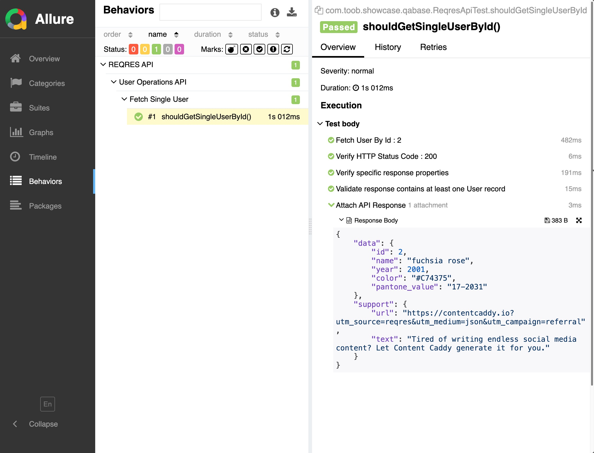

# QaBase HTTP - Framework Showcase

This project provides a a guide on how to use the QABase Framework. This frameworks was implemented in a modular fashion. <br/>
This means you can pick specific modules based on the main purpose of writing automating testes. In this case we will look the targeted **REST API Testing**. We will do so my focussing on the **QABAse HTTP** Module.<br/>
We will also mainly use Java to show that this Kotlin based framework is compatible with Java.
<br/>
<br/>

## TECH STACK

- **Java 21 +** : This is the base minimal java version we are working with.
- **Kotling 2.1.0 +** : _( Optional )_ If you want to use Kotlin for the JVM. Using Java in this case.
- **Allure Service | Bin** : You should perform a once off Allure Bin or Service on your machine.

<br/>
<br/>

## GETTING STARTED

### Adding Dependency
Add the dependency module that's tailored for HTTP REST API testing.

```xml
<!-- QA BASE Custom Libraries -->
<dependency>
    <groupId>com.toob</groupId>
    <artifactId>qabase-http</artifactId>
    <version>0.0.1</version>
</dependency>
```
<br/>


### Java Configuration
Remember we are using Spring in our framework, mainly Spring Boot toolkit to take advantage of the easy configuration and better Spring dependency management.<br/>
So we can go into our `src/main/resources/.. <your.root.package>` and create a new **SpringBootApplication** or **SpringBootConfiguration** Java / Kotlin class.
<br/>
<br/>
**NB** : _Make sure you import the CoreFrameworkFactory in order to Auto Configure the Framework components._<br/>

```java
// Example of [SpringBootConfiguration] file in this code base sample.
@SpringBootConfiguration
@EnableAutoConfiguration

// Import the Core Framework Spring Factory in order to be able to load all supplied beans.
@Import({QaBaseCoreModuleFactory.class})
public class AutomationModule {}
```
<br/>

### YAML | YML Configuration
You also need to configure the base HTTP REST API Url in your standard Spring Boot `application.yaml` file.<br/>

**NB** : _Take note of the key configurations you must include._

```yaml
# QA BASE CORE OVERRIDES
# ======================================================================================================================
web-service:
  # Base Target REST API URL 
  base-url: "https://reqres.in"
```
<br/>
<br/>

## TEST CASE IMPLEMENTATION

So far you are all good and this is very simple and minimal. You are basically just creating a Spring Boot Application with some Automation Testing GOODIES. We can get Into Action with some code.<br/>
Create a new Test Class based on the API you want to test. You will find a sample in the code looking like :
<br/>
<br/>


```java
@Epic("REQRES API")
@Feature("User Operations API")
@SpringBootTest
class ReqresApiTest extends AbstractHttpTest {

    @Test
    @Story("Fetch Single User")
    void shouldGetSingleUserById() {
        final String id = "2";

        Response response = step( String.format("Fetch User By Id : %s", id), () -> {
            Response resp = RestClient.get(String.format("/api/user/%s", id));
            assertNotNull(resp);
            return resp;
        });

        confirmStatusCode(200, response);

        step("Verify specific response properties", () -> {
            response.then().body("data.id", equalTo(2))
                    .body("data.name", equalTo("fuchsia rose"))
                    .body("data.year", equalTo(2001))
                    .body("data.color", equalTo("#C74375"))
                    .body("data.pantone_value", equalTo("17-2031"));
        });

        step("Validate response contains at least one User record", () -> {
            response.then().body("size()", greaterThan(0));
        });

        attachHttpResponse(response);
    }
}
```
<br/>

And that's all! Simple right. You get access to the Frameworks Abstraction and Support components.
You also get access to the standard framework and library tools for example : 

- **Allure Reports** : You have access to `@Epic`, `@Feature` and `@Story`
- **Spring Framwork | Boot** : You can write `@SpringBootTest`s already and take advantage or powerfull configuration and dependency injection. 
- **Rest Assured** : You get to apply the fluent `given()`, `when()` and `then()` _i.e._ `response.then().body("data.id", equalTo(2))`
<br/>

On top of all this you get the QaBase Framework to do some repetitive and heavy lifting with some custom features.
<br/>

### Allure Step Limitation
If you want log multiple steps inside one Test Case | Test Scenario or Story _( Java or Kotlin Method )_, then you can use the `step()` function as follows : 
```java
// ...

Response response = step( String.format("Fetch User By Id : %s", id), () -> {
    Response resp = RestClient.get(String.format("/api/user/%s", id));
    assertNotNull(resp);
    return resp;
});

// ... OR ...

step("Validate response contains at least one User record", () -> {
    response.then().body("size()", greaterThan(0));
});

//..
```
<br/>

### REST Assured Support
We have also started with a base `RestClient` that cna help you make REST API calls easier using REST Assured underneath. This simplifies your HTTP calls as follows : 

```java
// GET Example
Response resp = RestClient.get("/api/user/2");

// POST Example
Response resp = RestClient.post("/api/user/2", "{body-here}");

// And More ...
```
<br/>

There's more you can do with the **qabase-http** module, _i.e._ things like :
```java
// Quick Response Code Validation ...
confirmStatusCode(200, response);

// Attach your API Response to ALlure Reports ... 
attachHttpResponse(response);

// And More ...
```
<br/>
<br/>

## REPORTING

Once you have run your individual Test Suite or Test Case Class you can find the allure-reports in the root of your project `${your-project-folder/allure-results}`<br/>
And if you run your test via something like `mvn clean test` or `mvn clean verify` or even a `mvn clean install` then you are sorted with Report Generation in the target folder, **"../target/allure-results/"**
<br/>
<br/>

Running the command : `allure serve /allure-results` or `allure serve target/allure-results` respectively will spin up an Allure service you have installed on your machine and serve the content inside the **"../allure-results/"** folder. This command will also open your default browser to show you the reports of your test.
<br/>
<br/>


<br/>
<br/>

## CONCLUSION

All in all, this project serves as a guide on how to use the QaBase Framwork's **"qabase-http"** module. This ia a living document and will be updated accordingly as the framework grows or evolves. 

<br/>
<br/>
